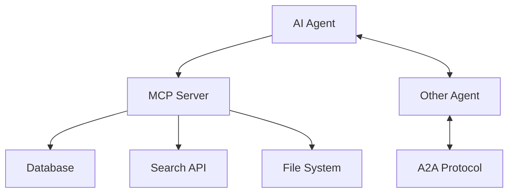

## はじめに

2025年が「AIエージェント元年」だったとすれば、2026年は「マルチエージェント時代」の幕開けです。Gartnerの調査によると、マルチエージェントシステムに関する問い合わせは2024年Q1から2025年Q2にかけて**1,445%**も急増しました。本記事では、2026年1月時点での最新動向をまとめます。

## 1. エージェンティックAIの市場動向

### 急成長する市場規模

AIエージェント市場は2024年の54億ドルから2025年には76.3億ドルに成長し、2030年には503億ドルに達すると予測されています（CAGR 45.8%）。

特に注目すべき点：

- **2026年末までに企業アプリの40%がAIエージェントを搭載**（2025年は5%未満）
- 2028年までにAIエージェントは**4,500億ドル**の経済価値を創出
- 一方で、現時点でフルスケール導入している組織は**わずか2%**

### 大手企業の動き

- **Meta**がManusを20億ドルで買収（2026年1月）
- **Thomson Reuters**がCoCounselでエージェント型ワークフローを開始
- **LexisNexis**が法務タスク向けに4つの専門エージェントを連携
- Big 4（PwC、KPMG、Deloitte、EY）が監査・会計業務向けAIエージェントシステムを展開

## 2. Model Context Protocol（MCP）の標準化

### MCPとは何か

AnthropicのModel Context Protocol（MCP）は、AIエージェントがデータベース、検索エンジン、APIなどの外部ツールと対話するための標準プロトコルです。「**AI版USB-C**」とも呼ばれ、エージェント間の相互運用性を実現します。

### 2025-2026年の進展

1. **Linux Foundationへの寄贈**：2025年12月、AnthropicはMCPをAgentic AI Foundation（AAIF）に寄贈。OpenAIとBlockが共同設立者として参加

2. **v1.0の主要機能**：
   - Remote TransportとOAuth 2.1サポート
   - Role-Based Access Control（RBAC）
   - マルチモーダルコンテキスト（動画、音声、センサーデータ対応）

3. **業界全体での採用**：
   - OpenAI、Microsoft、Googleが正式サポート
   - Googleは自社製品向けにマネージドMCPサーバーを構築中

### 関連プロトコルの登場

- **Agent-to-Agent (A2A)**: Googleのピアツーピア協調プロトコル
- **ACP**: IBMのガバナンスフレームワーク
- **Universal Commerce Protocol (UCP)**: GoogleのAIコマース向け標準（2026年1月発表）



## 3. マルチエージェントアーキテクチャの進化

### 「マイクロサービス革命」の再来

単一の大規模LLMですべてを処理するのではなく、**オーケストレーター（パペッティア）パターン**が主流に：

1. **Researcherエージェント**: 情報収集を担当
2. **Coderエージェント**: 実装を担当
3. **Analystエージェント**: 結果の検証を担当

### 主要フレームワーク比較（2026年版）

| フレームワーク | 設計思想 | 特徴 | 適用場面 |
|--------------|---------|------|---------|
| **LangGraph** | グラフベース | 状態マシンによる制御、トレーサビリティ | 複雑なワークフロー |
| **CrewAI** | ロールベース | 直感的なチーム構成、本番対応機能 | チーム協調タスク |
| **AutoGen** | 会話ベース | 自然言語での協調、Human-in-the-loop | プロトタイピング |

#### CrewAIの例

```python
from crewai import Agent, Task, Crew

# 専門エージェントの定義
researcher = Agent(
    role="リサーチャー",
    goal="最新のAI技術トレンドを調査する",
    backstory="10年以上の技術リサーチ経験を持つ専門家",
    tools=[search_tool, web_scraper]
)

writer = Agent(
    role="テクニカルライター",
    goal="調査結果を分かりやすい記事にまとめる",
    backstory="技術ブログで5年間執筆してきたライター"
)

# タスクの定義
research_task = Task(
    description="2026年のAIエージェントトレンドを調査",
    agent=researcher
)

write_task = Task(
    description="調査結果を日本語記事にまとめる",
    agent=writer
)

# Crewの構成と実行
crew = Crew(
    agents=[researcher, writer],
    tasks=[research_task, write_task],
    verbose=True
)

result = crew.kickoff()
```

## 4. Claude Codeの実践的活用テクニック

### CLAUDE.mdの重要性

Claude Codeで最も重要なファイルは、リポジトリルートの`CLAUDE.md`です。これはエージェントの「憲法」として機能します。

#### 推奨される構成

```markdown
# プロジェクト概要

## アーキテクチャ
- モノレポ構成: apps/, packages/
- テストフレームワーク: Vitest
- スタイリング: Tailwind CSS

## コーディングルール
- 小さな差分を好む
- 不要なリファクタリングは行わない
- 変更したロジックにはテストを追加

## 開発コマンド
- `pnpm dev` - 開発サーバー起動
- `pnpm test` - テスト実行
- `pnpm build` - ビルド
```

### ベストプラクティス

1. **簡潔に保つ**: フロンティアLLMは150-200の指示を一貫して従える
2. **ポインタを優先**: コードスニペットではなく`file:line`形式で参照
3. **リンターに任せる**: コードスタイルはリンターで強制
4. **反復的に改善**: CLAUDE.mdもプロンプトと同様に改善を続ける

### 生産性向上Tips

```bash
# /initでCLAUDE.mdを自動生成
claude /init

# コンテキストをクリアして新しいタスクに集中
/clear

# GitHub PRの自動レビュー設定
/install-github-app
```

#### サブエージェントの活用

単一セッションで全てを処理すると「コンテキスト汚染」が発生します。専門化されたサブエージェントを活用しましょう：

```
メインセッション
├── コードレビューエージェント
├── テスト生成エージェント
└── ドキュメント生成エージェント
```

### MCPサーバーによる機能拡張

```json
// .claude/mcp_settings.json
{
  "servers": {
    "postgres": {
      "command": "mcp-server-postgres",
      "args": ["postgresql://localhost:5432/mydb"]
    },
    "github": {
      "command": "mcp-server-github",
      "env": {
        "GITHUB_TOKEN": "${GITHUB_TOKEN}"
      }
    }
  }
}
```

## 5. 2026年の注目トレンド

### Small Language Models（SLM）の台頭

AT&Tのチーフデータオフィサーによると：

> 「ファインチューニングされたSLMが2026年の大きなトレンドになる。コストとパフォーマンスの優位性が、既製LLMよりも利用を促進する」

### 新モデルのリリース

- **NVIDIA Nemotron 3**: 100万トークンのコンテキストウィンドウ、4倍高速な推論
- **Zhipu AI GLM-4.7**: 20万コンテキスト、12.8万出力
- **Claude Opus 4.5 vs Gemini 3 Pro**: ベンチマーク比較が進行中

### ガバナンスの課題

Gartnerの予測によると、**2027年までにエージェントAIプロジェクトの40%がリスク管理の不備で失敗**するとされています。能力の向上に制御が追いついていない状況です。

## まとめ

2026年は、AIエージェントが「実験段階」から「本番運用」へと移行する転換点です。

**開発者が今すぐ始めるべきこと：**

1. **MCPを学ぶ**: エージェント開発の標準プロトコルとして定着
2. **マルチエージェントフレームワークを試す**: LangGraph、CrewAI、AutoGenから用途に合うものを選択
3. **CLAUDE.mdを整備**: Claude Codeを使うなら最優先で設定
4. **ガバナンス体制を構築**: スケール前にリスク管理を確立

AIエージェントは「便利なアシスタント」から「信頼できる同僚」へと進化しています。この波に乗り遅れないよう、今から準備を始めましょう。

## 参考リンク

- [Model Context Protocol 仕様](https://modelcontextprotocol.io/specification/2025-11-25)
- [Claude Code ベストプラクティス（Anthropic公式）](https://www.anthropic.com/engineering/claude-code-best-practices)
- [CrewAI ドキュメント](https://docs.crewai.com/)
- [LangGraph ガイド](https://langchain-ai.github.io/langgraph/)
