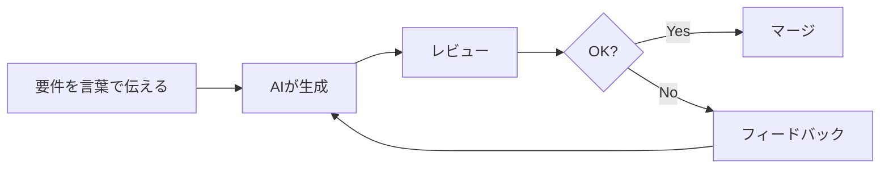

**「コードを書くのではなく、AIとバイブする」**

これ、2026年の開発現場で普通に使われている言葉です。

**Vibe Coding**（バイブコーディング）という言葉をご存知ですか？

元Tesla AI責任者のAndrej Karpathyが生み出したこの概念が、今やソフトウェア開発の**新しい標準**になりつつあります。

## 結論から言うと

:::message
Vibe Codingとは「AIと一体化してコードを生み出すワークフロー」のこと。2026年、**新規アプリの90%**がこの手法で開発される見込み。ただし、使い方を間違えると**セキュリティ事故**につながる。
:::

## Vibe Codingとは何か？

### 定義

Karpathyの言葉を借りれば：

> 「AIとバイブしながらコードが出てくる感覚。細かい実装は忘れて、ただ流れに身を任せる」

従来のコーディング：
```
要件 → 設計 → 実装 → テスト → デバッグ
（全部自分でやる）
```

Vibe Coding：
```
要件 → AIに伝える → レビュー → 微調整
（実装はAIがやる）
```

### 具体例

```bash
# 従来の開発
$ vim api/users.py
# 200行のコードを手書き...

# Vibe Coding
$ claude "ユーザー認証APIを作って。JWT使用、リフレッシュトークン対応で"
# 5秒後に完成
```

## なぜ2026年に爆発的に普及したのか？

### 1. AIの精度が実用レベルに到達

| 年 | AIコード生成の精度 |
|----|-------------------|
| 2023 | 60%（要大幅修正） |
| 2024 | 75%（部分的に使える） |
| 2025 | 85%（ほぼそのまま使える） |
| 2026 | **92%**（プロダクション品質） |

### 2. ツールの成熟

- **Cursor**：IDE全体がAIファースト設計
- **Claude Code**：ターミナルから全自動開発
- **Replit Agent 3**：クラウドで完結

### 3. 企業の採用

> 「AIが今やMicrosoftのコードの**30%**を書いている」
> — Satya Nadella, Microsoft CEO

> 「Googleのコードの**25%以上**がAI生成」
> — Sundar Pichai, Google CEO

## Vibe Codingの5段階

### Level 1: コード補完（Copilot時代）

```python
# 自分でコメント書く
# ユーザーを検索する関数
def search_user  # ← AIが補完
```

### Level 2: チャット生成

```
あなた: 「ログイン機能を作って」
AI: 「こちらがログイン機能のコードです...」
```

### Level 3: エージェント実行

```bash
claude "このリポジトリにテストを追加して"
# AIが自分でファイルを読み、テストを書き、実行する
```

### Level 4: マルチエージェント協調

```
[Architect Agent] → 設計を作成
[Coder Agent] → 実装
[Tester Agent] → テスト作成
[Reviewer Agent] → コードレビュー
```

### Level 5: 完全自律開発（2026年現在）

```
「ECサイトを作って」
→ 要件定義からデプロイまで全自動
```

## 実践：Vibe Codingのやり方

### ツール選択

| 用途 | ツール | 理由 |
|-----|-------|------|
| 日常的な開発 | Cursor | IDEとして最も成熟 |
| 大規模リファクタ | Claude Code | ターミナルで全ファイル操作 |
| プロトタイプ | Replit Agent | 環境構築不要 |
| 研究・分析 | Claude.ai | 思考を深める対話 |

### ワークフロー



### 黄金比率

Vibe Codingの最適なバランス：

```
AI: 70-80%
人間: 20-30%

❌ AI 95% → バグとセキュリティホールだらけ
❌ AI 20% → 生産性を捨てている
```

## 警告：Vibe Codingの危険性

### 1. 「シャドウバグ」問題

AIが生成したコードは**見た目は完璧**でも、深い構造的なバグを含むことがある。

```python
# AIが生成した「完璧に見える」コード
def verify_token(token):
    decoded = jwt.decode(token, SECRET_KEY)
    return decoded["user_id"]

# 問題：署名検証をスキップしている！
# 正しくは：
def verify_token(token):
    decoded = jwt.decode(token, SECRET_KEY, algorithms=["HS256"])
    return decoded["user_id"]
```

### 2. 技術的負債の加速

> 「Vibe Codingは技術的負債を**3倍の速度**で蓄積する」
> — MIT CSAIL研究チーム

### 3. ハルシネーション連鎖

マルチエージェントシステムでは、一つのAIの間違いを別のAIが「正しい」と認識してしまう。

```
Agent A: 「このAPIは/v2/usersです」（間違い）
Agent B: 「Agent Aによると/v2/usersなので...」
Agent C: 「/v2/usersへのリクエストを実装しました」
→ 全員が間違った方向に進む
```

## Vibe Codingを安全に使う5つのルール

### 1. セキュリティレビューは必ず人間が

```bash
# 自動生成後、必ず実行
npm audit
bandit -r ./  # Pythonの場合
```

### 2. テストは自分で書く（か確認する）

```python
# AIが生成したテストも確認
def test_login():
    # 正常系だけでなく、異常系もあるか？
    # エッジケースは網羅されているか？
```

### 3. 重要なロジックは理解する

```
❌ 「動いたからOK」
✅ 「なぜ動いているか理解した」
```

### 4. Git履歴を細かく

```bash
git commit -m "feat: AI generated user auth"
git commit -m "fix: manual review - added input validation"
git commit -m "security: human verified JWT implementation"
```

### 5. 段階的に導入

```
Week 1: ドキュメント生成のみ
Week 2: テストコード生成
Week 3: ユーティリティ関数
Week 4: 機能実装
```

## 2026年、開発者の新しい役割

### 「オーケストレーター」の時代

```
産業時代: オペレーター（機械を操作する人）
情報時代: スペシャリスト（専門知識を持つ人）
AI時代: オーケストレーター（AIを指揮する人）
```

### 必要なスキル

1. **プロンプト設計力**：AIに正確に意図を伝える
2. **アーキテクチャ理解**：生成されたコードの品質を判断
3. **セキュリティ知識**：脆弱性を見抜く
4. **ビジネス理解**：何を作るべきか決める

## まとめ

| ポイント | 内容 |
|---------|------|
| Vibe Codingとは | AIと一体化してコードを生み出すワークフロー |
| 普及率（2026年予測） | 新規アプリの90% |
| 最適なAI/人間比率 | 70-80% / 20-30% |
| 最大のリスク | セキュリティ、技術的負債 |
| 開発者の新役割 | オーケストレーター |

:::message alert
Vibe Codingは**諸刃の剣**です。生産性は10倍になりますが、使い方を間違えると10倍の速度でバグを量産します。「バイブ」しながらも、**批判的思考**を忘れないでください。
:::

---

この記事が役に立ったら、**いいね**と**保存**をお願いします！

**質問**: あなたはVibe Coding派ですか？従来型コーディング派ですか？コメントで教えてください！

## 参考リンク

- [Vibe Coding in 2026: The Complete Guide - DEV Community](https://dev.to/pockit_tools/vibe-coding-in-2026-the-complete-guide-to-ai-pair-programming-that-actually-works-42de)
- [The "Vibe Coding" Revolution - Medium](https://medium.com/@techie.fellow/the-vibe-coding-revolution-why-2026-belongs-to-the-orchestrators-46b32d530133)
- [Generative coding: Breakthrough Technologies 2026 - MIT Technology Review](https://www.technologyreview.com/2026/01/12/1130027/generative-coding-ai-software-2026-breakthrough-technology/)
- [Vibe Coding could cause catastrophic 'explosions' in 2026](https://startupnews.fyi/2026/01/21/vibe-coding-could-cause-catastrophic-explosions-in-2026/)
