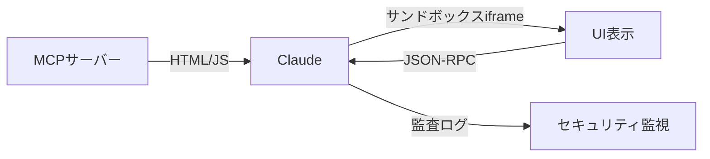

## まだチャットボットだと思ってる？それ、もう時代遅れです

**「AIはテキストを返すだけの存在」**

そう思っていませんか？

2026年1月26日、その常識が完全に覆されました。

Anthropicが発表した**MCP Apps**により、Claudeはチャット画面の中で**サードパーティアプリのUIを直接表示・操作**できるようになったのです。

Figmaのデザイン、Slackのメッセージ、Asanaのタスクボード——すべてがClaudeの会話画面内で完結する時代が来ました。

:::message
**結論から言うと：** MCP AppsはAIアシスタントを「テキスト応答マシン」から「統合アプリプラットフォーム」へ進化させる革命的な技術です。
:::

## MCP Appsとは？3つのポイントで理解する

### 1. AIがUIを返せるようになった

これまでのAI：
```
ユーザー: 「売上データをグラフで見せて」
AI: 「こちらがデータです: 1月: 100万円、2月: 120万円...」（テキストのみ）
```

MCP Apps導入後：
```
ユーザー: 「売上データをグラフで見せて」
AI: [インタラクティブなグラフがチャット内に表示される]
```

**ツールが「リッチでインタラクティブなUI」を返せるようになった**のです。

### 2. サンドボックス化されたiframeで安全に実行

セキュリティが心配？大丈夫です。



- すべてのUIは**サンドボックス化されたiframe**内で実行
- ホストとの通信は**監査可能なJSON-RPCメッセージ**のみ
- ユーザーの**明示的な承認**が必要な操作は事前に確認

### 3. OpenAIとの異例のコラボレーション

驚くべきことに、AnthropicはOpenAIと**共同で**MCP Apps拡張（SEP-1865）を開発しました。

> 「MCPコミュニティから最もリクエストの多かった機能の一つ」

AI業界のライバル同士が協力し、**オープンスタンダード**を作り上げたのです。これにより：

- ChatGPT
- Claude
- Goose
- Visual Studio Code

すべてがMCP Appsをサポートしています。

## ローンチパートナー10社が豪華すぎる

1月26日のローンチ時点で、以下の企業が対応を表明：

| 企業 | できること |
|:---|:---|
| **Figma** | デザインをチャット内でプレビュー・編集 |
| **Slack** | メッセージの確認・返信をClaude内で完結 |
| **Asana** | タスクボードの操作・更新 |
| **Canva** | デザイン作成・編集 |
| **monday.com** | プロジェクト管理 |
| **Amplitude** | 分析ダッシュボード表示 |
| **Hex** | データ分析・可視化 |
| **Box** | ファイル管理 |
| **Clay** | CRMデータ操作 |
| **Salesforce** | 近日対応予定 |

:::message alert
**注意**: 現時点ではローンチパートナーのみ対応。自作アプリの組み込みは今後のエコシステム拡大を待つ必要があります。
:::

## 実際の使い方：デモコードで理解する

MCPサーバー側でUIを返す実装イメージ：

```typescript:mcp-server-example.ts
import { MCPServer } from '@anthropic/mcp-sdk';

const server = new MCPServer();

server.registerTool({
  name: 'show_analytics_dashboard',
  description: '分析ダッシュボードを表示',
  handler: async (params) => {
    // UIリソースを返す
    return {
      type: 'ui_resource',
      content: {
        html: `
          <div class="dashboard">
            <h2>売上分析</h2>
            <canvas id="chart"></canvas>
            <script>
              // Chart.jsでグラフ描画
              renderChart(${JSON.stringify(params.data)});
            </script>
          </div>
        `,
        permissions: ['display', 'interact']
      }
    };
  }
});
```

クライアント（Claude）側では、このUIがサンドボックスiframe内にレンダリングされます。

## なぜこれが革命なのか？3つの理由

### 理由1: AIが「見せる」から「やらせる」へ

従来のRAG（検索拡張生成）では、AIは情報を「取得して説明する」だけでした。

MCP Appsでは：

```
Before: AI → テキストで説明 → ユーザーが別アプリで操作
After:  AI → UI表示 → ユーザーがその場で操作 → 結果をAIに戻す
```

**ワークフローが完全にAI内で完結**するようになります。

### 理由2: コンテキストスイッチの撲滅

1日に平均**1,200回**もアプリを切り替えている現代人。

MCP Appsなら：
- Slackを開く必要なし
- Figmaを開く必要なし
- スプレッドシートを開く必要なし

**すべてがClaudeの中**で完結します。

### 理由3: エージェントAIの真の基盤

2026年は「AIエージェント元年」と言われていますが、エージェントが本当に自律的に動くには**ツールとの深い統合**が必要です。

MCP Appsはまさにその基盤。AIエージェントが：
- UIを理解し
- 操作を実行し
- 結果を確認できる

これがなければ、AIエージェントは「指示待ちbot」のままです。

## MCP Tool Searchも同時発表：コンテキスト問題を解決

同時期に発表された**MCP Tool Search**も見逃せません。

### 問題: MCPサーバー接続でトークンが爆発

複数のMCPサーバーを接続すると、ツール定義だけで**67,000トークン**消費する事例も。

### 解決策: 遅延読み込み

```
Before: すべてのツール定義を事前読み込み → 大量のトークン消費
After:  必要なツールだけオンデマンドで読み込み → 46.9%削減
```

コンテキストウィンドウの10%以上をMCPツールが占める場合、自動的にTool Searchが有効化されます。

:::message
**対応モデル**: Sonnet 4以降、Opus 4以降のみ。Haikuは非対応です。
:::

## 利用できるプラン

| プラン | MCP Apps対応 |
|:---|:---:|
| Free | ❌ |
| Pro | ✅ |
| Max | ✅ |
| Team | ✅ |
| Enterprise | ✅ |

**有料プランであれば利用可能**です。

## まとめ: AIの新時代が始まった

MCP Appsがもたらす変化をまとめると：

- ✅ **AIがUIを表示できる** → テキストだけの時代は終わり
- ✅ **サードパーティアプリがClaude内で動く** → アプリ切り替え不要
- ✅ **OpenAIとの共同開発** → 業界標準として普及確実
- ✅ **セキュリティ設計が堅牢** → 企業利用も安心

2026年はAIエージェントが本格化する年と言われています。

MCP Appsは、その**最も重要な基盤技術**の一つになるでしょう。

---

## 参考リンク

- [MCP Apps - Bringing UI Capabilities To MCP Clients（公式ブログ）](http://blog.modelcontextprotocol.io/posts/2026-01-26-mcp-apps/)
- [Claude supports MCP Apps - The Register](https://www.theregister.com/2026/01/26/claude_mcp_apps_arrives/)
- [Claude Code Release Notes - January 2026](https://releasebot.io/updates/anthropic/claude-code)

---

**この記事が役に立ったら、いいね👍とストックをお願いします！**

「MCP Apps試してみた」「こんな使い方を考えている」など、コメントもお待ちしています。

次回は「MCP Appsで自作ダッシュボードを作る方法」を解説予定です。お楽しみに！
